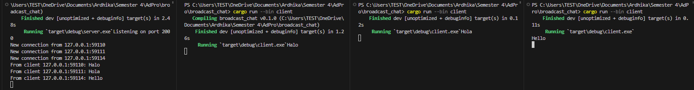

# 📝 Tutorial & Exercise 10 📝

**Student Details:**

| Attribute  | Information                |
|------------|----------------------------|
| Name       | Ardhika Satria Narendra    |
| Student ID | 2206821866                 |
| Class      | Advanced Programming KKI   |

---

Module 10: High-Level Networking Part 2

## Questions and Answers

### -> Reflection

#### Experiment 2.1: Original code, and how it run

To demonstrate the functionality of the broadcast chat application described in the tutorial, I began by compiling the server using the command `cargo build --bin server`. This step ensured that all dependencies were resolved and the server was ready to execute. Subsequently, I launched the server with `cargo run --bin server`, which started listening on port 2000, as indicated by the terminal outputs. Following the server setup, I compiled the client using `cargo build --bin client` to prepare the client executable. To simulate a real-world scenario, I initiated three separate instances of the client by running `cargo run --bin client` in three different terminal windows. Each client was able to connect to the server successfully, and I tested the setup by typing messages into each client’s terminal. These messages were promptly displayed in the server's terminal, showcasing the server’s capability to handle multiple client connections and relay messages between them. The server terminal displayed the port it was listening on and logged new connections from the clients, including the IP address and port number of each client. This exercise provided practical insights into how asynchronous communication is managed in a networked environment, emphasizing the efficiency of using WebSockets for real-time data exchange in a chat application.

---

