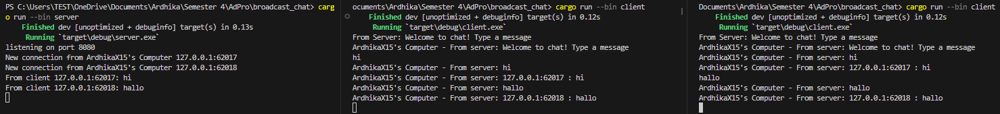

# 📝 Tutorial & Exercise 10 📝

**Student Details:**

| Attribute  | Information                |
|------------|----------------------------|
| Name       | Ardhika Satria Narendra    |
| Student ID | 2206821866                 |
| Class      | Advanced Programming KKI   |

---

Module 10: High-Level Networking Part 2

## Questions and Answers

### -> Reflection

#### Experiment 2.1: Original code, and how it run

To demonstrate the functionality of the broadcast chat application described in the tutorial, I began by compiling the server using the command `cargo build --bin server`. This step ensured that all dependencies were resolved and the server was ready to execute. Subsequently, I launched the server with `cargo run --bin server`, which started listening on port 2000, as indicated by the terminal outputs. Following the server setup, I compiled the client using `cargo build --bin client` to prepare the client executable. To simulate a real-world scenario, I initiated three separate instances of the client by running `cargo run --bin client` in three different terminal windows. Each client was able to connect to the server successfully, and I tested the setup by typing messages into each client’s terminal. These messages were promptly displayed in the server's terminal, showcasing the server’s capability to handle multiple client connections and relay messages between them. The server terminal displayed the port it was listening on and logged new connections from the clients, including the IP address and port number of each client. This exercise provided practical insights into how asynchronous communication is managed in a networked environment, emphasizing the efficiency of using WebSockets for real-time data exchange in a chat application.

#### Experiment 2.2: Modifying port

In part 2.2 of the tutorial, I focused on modifying the websocket port used by the broadcast chat application from the default setting to port 8080. This task required adjustments in both the server and client configurations to ensure seamless communication post-modification. Initially, I located the sections of the code where the websocket port was defined: the TcpListener binding in the server code and the URI setup in the client code. I modified the server's code in `server.rs` to bind the TcpListener to `"127.0.0.1:8080"`, shifting from the previously used port 2000. Correspondingly, in the client code (`client.rs`), I updated the connection URI in the ClientBuilder to `"ws://127.0.0.1:8080"`. After making these changes, I recompiled both components using `cargo build --bin server` and `cargo build --bin client`. Subsequent testing involved running the modified server and several clients, where I verified that connections were established correctly and that messages were exchanged without any issues across the new port. This change was documented thoroughly in the README.md, including the rationale behind choosing a new port and the necessary adjustments to both server and client codes. The successful modification and testing confirmed the application’s adaptability to different network environments and demonstrated its robustness in handling changes in network configurations.

#### Experiment 2.3: Small changes, add IP and Port

To incorporate the sender's IP address and port number into each message in the broadcast chat application, I utilized the `socket` library to retrieve the connection details of the client. Specifically, the `socket.getsockname()` function was employed to fetch the IP address and port number associated with the client's socket. This information was then formatted into a string along with the message content using Rust's `format!` macro, resulting in a message that includes both the sender's details and their text. The formatted message was serialized—using JSON or a similar method depending on the application's requirements—before being sent through the websocket connection to the server. On the server side, adjustments were made to parse this enhanced message format and broadcast it to other clients. This modification not only aids in identifying the source of each message but also enhances the functionality of the chat system by allowing participants to see the origin of each communication, which can be particularly beneficial for debugging and monitoring purposes.

---

